# Teia de Conexoes (Narrador)

Versao visual (sem HTML): veja `01_BACKGROUND_NARRADOR/teia_de_conexoes_mapa.svg` (ou `.png`).

## Grafo (Mermaid)

```mermaid
graph TD
  ventrue_artur_macedo["Artur Macedo"]
  ventrue_isabel_amaral["Isabel do Amaral"]
  ventrue_mateus_cordeiro["Mateus Cordeiro"]
  toreador_luiza_salles["Luiza Salles"]
  toreador_helena_vasconcelos["Helena Vasconcelos"]
  toreador_daniel_sato["Daniel Sato"]
  banuhaqim_samira_al_haddad["Samira al-Haddad"]
  banuhaqim_yusuf_rahman["Yusuf Rahman"]
  nosferatu_nico_sombra["Nico 'Sombra'"]
  nosferatu_vovo_zilda["Vovo Zilda"]
  nosferatu_ester_gato_preto["Ester 'Gato-Preto'"]
  brujah_renata_ferraz["Renata Ferraz"]
  brujah_joao_do_trem["Joao do Trem"]
  brujah_caua_martins["Caua Martins"]
  ministry_talita_serpente["Talita 'Serpente'"]
  ministry_elias_sal["Elias 'Sal'"]
  lasombra_padre_miguel_aranha["Padre Miguel Aranha"]
  tremere_dario_kron["Dario Kron"]
  tremere_bianca_saramago["Bianca Saramago"]
  hecata_donato_lazzari["Donato Lazzari"]
  hecata_soraia_nunes["Soraia Nunes"]
  hecata_iago_siqueira["Iago Siqueira"]
  lasombra_camila_noite_funda["Camila 'Noite-Funda'"]
  malkavian_paulo_vidente["Paulo 'O Vidente'"]
  malkavian_cecilia_linha_dois["Cecilia 'Linha-Dois'"]
  gangrel_bia_matilha["Bia 'Matilha'"]
  gangrel_hector_rodoanel["Hector 'Rodoanel'"]
  caitiff_rafa_ferro["Rafa 'Ferro'"]
  caitiff_livia_semnome["Livia 'Sem-Nome'"]
  thinblood_ana_carbono["Ana 'Carbono'"]
  thinblood_dante_fumo["Dante 'Fumo'"]
  thinblood_katia_zero["Katia 'Zero'"]
  thinblood_luan_patch["Luan 'Patch'"]
  ravnos_ravi_truque["Ravi 'Truque'"]
  ravnos_maru_vento["Maru 'Vento'"]
  salubri_irene_da_luz["Irene da Luz"]
  tzimisce_nina_costura["Nina 'Costura'"]
  tzimisce_vlado_itapecerica["Vlado de Itapecerica"]
  ventrue_artur_macedo -->|boon_due| toreador_luiza_salles
  ventrue_artur_macedo -->|employer| banuhaqim_samira_al_haddad
  ventrue_artur_macedo -->|ally| nosferatu_nico_sombra
  ventrue_isabel_amaral -->|mentor| ventrue_artur_macedo
  ventrue_isabel_amaral -->|rival| tremere_dario_kron
  ventrue_isabel_amaral -->|ally| lasombra_padre_miguel_aranha
  ventrue_mateus_cordeiro -->|rival| toreador_luiza_salles
  ventrue_mateus_cordeiro -->|uneasy| banuhaqim_samira_al_haddad
  ventrue_mateus_cordeiro -->|client| nosferatu_nico_sombra
  toreador_luiza_salles -->|boon_owed| ventrue_artur_macedo
  toreador_luiza_salles -->|rival| nosferatu_nico_sombra
  toreador_luiza_salles -->|uneasy| ministry_talita_serpente
  toreador_helena_vasconcelos -->|mentor| toreador_luiza_salles
  toreador_helena_vasconcelos -->|ally| banuhaqim_samira_al_haddad
  toreador_helena_vasconcelos -->|client| ventrue_artur_macedo
  toreador_daniel_sato -->|childe| toreador_luiza_salles
  toreador_daniel_sato -->|ally| thinblood_ana_carbono
  toreador_daniel_sato -->|client| nosferatu_nico_sombra
  banuhaqim_samira_al_haddad -->|liege| ventrue_artur_macedo
  banuhaqim_samira_al_haddad -->|boon_owed| nosferatu_nico_sombra
  banuhaqim_samira_al_haddad -->|rival| brujah_renata_ferraz
  banuhaqim_yusuf_rahman -->|sire| banuhaqim_samira_al_haddad
  banuhaqim_yusuf_rahman -->|uneasy| hecata_donato_lazzari
  banuhaqim_yusuf_rahman -->|ally| ventrue_isabel_amaral
  nosferatu_nico_sombra -->|ally| ventrue_artur_macedo
  nosferatu_nico_sombra -->|boon_due| banuhaqim_samira_al_haddad
  nosferatu_nico_sombra -->|rival| toreador_luiza_salles
  nosferatu_vovo_zilda -->|sire| nosferatu_nico_sombra
  nosferatu_vovo_zilda -->|uneasy| hecata_donato_lazzari
  nosferatu_vovo_zilda -->|ally| malkavian_paulo_vidente
  nosferatu_ester_gato_preto -->|childe| nosferatu_nico_sombra
  nosferatu_ester_gato_preto -->|ally| brujah_renata_ferraz
  nosferatu_ester_gato_preto -->|friend| thinblood_ana_carbono
  brujah_renata_ferraz -->|rival| banuhaqim_samira_al_haddad
  brujah_renata_ferraz -->|ally| gangrel_bia_matilha
  brujah_renata_ferraz -->|uneasy| caitiff_rafa_ferro
  brujah_joao_do_trem -->|sire| brujah_renata_ferraz
  brujah_joao_do_trem -->|ally| malkavian_cecilia_linha_dois
  brujah_joao_do_trem -->|protector| thinblood_dante_fumo
  brujah_caua_martins -->|childe| brujah_renata_ferraz
  brujah_caua_martins -->|boon_owed| ministry_elias_sal
  brujah_caua_martins -->|uneasy| gangrel_bia_matilha
  ministry_talita_serpente -->|pressure| toreador_luiza_salles
  ministry_talita_serpente -->|rival| lasombra_padre_miguel_aranha
  ministry_talita_serpente -->|supplier| thinblood_ana_carbono
  ministry_elias_sal -->|childe| ministry_talita_serpente
  ministry_elias_sal -->|creditor| brujah_caua_martins
  ministry_elias_sal -->|uneasy| brujah_renata_ferraz
  lasombra_padre_miguel_aranha -->|ally| ventrue_isabel_amaral
  lasombra_padre_miguel_aranha -->|uneasy| tremere_dario_kron
  lasombra_padre_miguel_aranha -->|rival| ministry_talita_serpente
  tremere_dario_kron -->|rival| ventrue_isabel_amaral
  tremere_dario_kron -->|boon_owed| hecata_donato_lazzari
  tremere_dario_kron -->|uneasy| lasombra_padre_miguel_aranha
  tremere_bianca_saramago -->|childe| tremere_dario_kron
  tremere_bianca_saramago -->|client| hecata_soraia_nunes
  tremere_bianca_saramago -->|ally| toreador_helena_vasconcelos
  hecata_donato_lazzari -->|boon_due| tremere_dario_kron
  hecata_donato_lazzari -->|uneasy| banuhaqim_yusuf_rahman
  hecata_donato_lazzari -->|uneasy| nosferatu_vovo_zilda
  hecata_soraia_nunes -->|childe| hecata_donato_lazzari
  hecata_soraia_nunes -->|client| tremere_bianca_saramago
  hecata_soraia_nunes -->|ally| malkavian_paulo_vidente
  hecata_iago_siqueira -->|childe| hecata_donato_lazzari
  hecata_iago_siqueira -->|client| ventrue_artur_macedo
  hecata_iago_siqueira -->|client| toreador_luiza_salles
  lasombra_camila_noite_funda -->|childe| lasombra_padre_miguel_aranha
  lasombra_camila_noite_funda -->|ally| brujah_renata_ferraz
  lasombra_camila_noite_funda -->|uneasy| nosferatu_nico_sombra
  malkavian_paulo_vidente -->|ally| nosferatu_vovo_zilda
  malkavian_paulo_vidente -->|ally| brujah_joao_do_trem
  malkavian_paulo_vidente -->|friend| salubri_irene_da_luz
  malkavian_cecilia_linha_dois -->|ally| brujah_joao_do_trem
  malkavian_cecilia_linha_dois -->|friend| thinblood_dante_fumo
  malkavian_cecilia_linha_dois -->|uneasy| gangrel_hector_rodoanel
  gangrel_bia_matilha -->|ally| brujah_renata_ferraz
  gangrel_bia_matilha -->|sire| gangrel_hector_rodoanel
  gangrel_bia_matilha -->|ally| thinblood_luan_patch
  gangrel_hector_rodoanel -->|childe| gangrel_bia_matilha
  gangrel_hector_rodoanel -->|uneasy| malkavian_cecilia_linha_dois
  gangrel_hector_rodoanel -->|client| nosferatu_nico_sombra
  caitiff_rafa_ferro -->|uneasy| brujah_renata_ferraz
  caitiff_rafa_ferro -->|ally| thinblood_ana_carbono
  caitiff_rafa_ferro -->|uneasy| ministry_elias_sal
  caitiff_livia_semnome -->|handler| banuhaqim_samira_al_haddad
  caitiff_livia_semnome -->|client| ventrue_artur_macedo
  caitiff_livia_semnome -->|ally| nosferatu_nico_sombra
  thinblood_ana_carbono -->|ally| toreador_daniel_sato
  thinblood_ana_carbono -->|supplier| ministry_talita_serpente
  thinblood_ana_carbono -->|ally| caitiff_rafa_ferro
  thinblood_dante_fumo -->|protector| brujah_joao_do_trem
  thinblood_dante_fumo -->|friend| malkavian_cecilia_linha_dois
  thinblood_dante_fumo -->|client| nosferatu_nico_sombra
  thinblood_katia_zero -->|uneasy| nosferatu_nico_sombra
  thinblood_katia_zero -->|target| banuhaqim_samira_al_haddad
  thinblood_katia_zero -->|friend| tremere_bianca_saramago
  thinblood_luan_patch -->|mentor| salubri_irene_da_luz
  thinblood_luan_patch -->|ally| gangrel_bia_matilha
  thinblood_luan_patch -->|client| hecata_donato_lazzari
  ravnos_ravi_truque -->|client| nosferatu_nico_sombra
  ravnos_ravi_truque -->|rival| toreador_luiza_salles
  ravnos_ravi_truque -->|uneasy| banuhaqim_samira_al_haddad
  ravnos_maru_vento -->|childe| ravnos_ravi_truque
  ravnos_maru_vento -->|ally| brujah_renata_ferraz
  ravnos_maru_vento -->|friend| gangrel_bia_matilha
  salubri_irene_da_luz -->|friend| malkavian_paulo_vidente
  salubri_irene_da_luz -->|mentor| thinblood_luan_patch
  salubri_irene_da_luz -->|uneasy| banuhaqim_samira_al_haddad
  tzimisce_nina_costura -->|uneasy| hecata_donato_lazzari
  tzimisce_nina_costura -->|rival| tremere_dario_kron
  tzimisce_nina_costura -->|client| lasombra_camila_noite_funda
  tzimisce_vlado_itapecerica -->|childe| tzimisce_nina_costura
  tzimisce_vlado_itapecerica -->|uneasy| gangrel_bia_matilha
  tzimisce_vlado_itapecerica -->|uneasy| hecata_soraia_nunes
```

## Listas de adjacencia

### Ana "Carbono" (Thin Blood)

- Daniel Sato [ally]: anonimato em troca de favores
- Talita "Serpente" [supplier]: milagres por boons
- Rafa "Ferro" [ally]: protecao de base

### Artur Macedo (Ventrue)

- Sire: Isabel do Amaral
- Childer: Mateus Cordeiro
- Luiza Salles [boon_due]: ela deve um Major pela crise de 2034
- Samira al-Haddad [employer]: Xerife, tolerado por eficiencia
- Nico "Sombra" [ally]: informacao em troca de neutralidade

### Bia "Matilha" (Gangrel)

- Childer: Hector "Rodoanel"
- Renata Ferraz [ally]: fronteira protegida
- Hector "Rodoanel" [sire]: ensina sobrevivencia dura
- Luan "Patch" [ally]: ajuda medica nas bordas

### Bianca Saramago (Tremere)

- Sire: Dario Kron
- Dario Kron [childe]: lealdade e medo
- Soraia Nunes [client]: paga por silencio de mortos
- Helena Vasconcelos [ally]: acesso a eventos e bibliotecas privadas

### Camila "Noite-Funda" (Lasombra)

- Sire: Padre Miguel Aranha
- Padre Miguel Aranha [childe]: odio e dependencia
- Renata Ferraz [ally]: apoio mutuo na fronteira
- Nico "Sombra" [uneasy]: rotas e apagao

### Caua Martins (Brujah)

- Sire: Renata Ferraz
- Renata Ferraz [childe]: lealdade e ambicao
- Elias "Sal" [boon_owed]: favor sujo por dinheiro e culto
- Bia "Matilha" [uneasy]: nao confia em 'animais' na politica

### Cecilia "Linha-Dois" (Malkavian)

- Sire: Paulo "O Vidente"
- Joao do Trem [ally]: protege suas rotas
- Dante "Fumo" [friend]: mensagens e sumicos
- Hector "Rodoanel" [uneasy]: ele segue rastros demais

### Daniel Sato (Toreador)

- Sire: Luiza Salles
- Luiza Salles [childe]: dependencia afetiva e politica
- Ana "Carbono" [ally]: troca favores por anonimato digital
- Nico "Sombra" [client]: compra boatos com boatos

### Dante "Fumo" (Thin Blood)

- Joao do Trem [protector]: o velho o protege por principio
- Cecilia "Linha-Dois" [friend]: mensagens e pressagios
- Nico "Sombra" [client]: faz entregas para ele

### Dario Kron (Tremere)

- Childer: Bianca Saramago
- Isabel do Amaral [rival]: ela odeia o imprevisivel dos rituais
- Donato Lazzari [boon_owed]: Minor; intermediacao com mortos
- Padre Miguel Aranha [uneasy]: nao confia em sombras na Camarilla

### Donato Lazzari (Hecata)

- Childer: Iago Siqueira
- Dario Kron [boon_due]: Minor; intermediacao com mortos
- Yusuf Rahman [uneasy]: juiz odeia seus negocios
- Vovo Zilda [uneasy]: subsolo dividido

### Elias "Sal" (Ministry)

- Sire: Talita "Serpente"
- Talita "Serpente" [childe]: devocao e ressentimento
- Caua Martins [creditor]: favor sujo em aberto
- Renata Ferraz [uneasy]: usa a baronia como zona cinza

### Ester "Gato-Preto" (Nosferatu)

- Sire: Nico "Sombra"
- Nico "Sombra" [childe]: relacao de controle e protecao
- Renata Ferraz [ally]: Anarchs a protegem por utilidade
- Ana "Carbono" [friend]: rede de sumico digital

### Hector "Rodoanel" (Gangrel)

- Sire: Bia "Matilha"
- Bia "Matilha" [childe]: lealdade e vontade de provar valor
- Cecilia "Linha-Dois" [uneasy]: ela sabe demais de rotas
- Nico "Sombra" [client]: vende rotas e horarios

### Helena Vasconcelos (Toreador)

- Childer: Luiza Salles
- Luiza Salles [mentor]: sire e aliada
- Samira al-Haddad [ally]: seguranca discreta em eventos
- Artur Macedo [client]: vende paz em troca de influencia

### Iago Siqueira (Hecata)

- Sire: Donato Lazzari
- Donato Lazzari [childe]: aprendeu a cobrar com o sire
- Artur Macedo [client]: compra silencio e rastros
- Luiza Salles [client]: vende paz social com juros

### Irene da Luz (Salubri)

- Paulo "O Vidente" [friend]: pressagios e cura
- Luan "Patch" [mentor]: ensinou etica de sangue
- Samira al-Haddad [uneasy]: acordo de silencio antigo

### Isabel do Amaral (Ventrue)

- Childer: Artur Macedo
- Artur Macedo [mentor]: sire e conselheira
- Dario Kron [rival]: nao confia em magia fora de controle
- Padre Miguel Aranha [ally]: acordo de integracao discreta

### Joao do Trem (Brujah)

- Childer: Renata Ferraz
- Renata Ferraz [sire]: orgulho e culpa
- Cecilia "Linha-Dois" [ally]: pressagios em troca de protecao
- Dante "Fumo" [protector]: nao gosta de ver jovens queimados

### Katia "Zero" (Thin Blood)

- Nico "Sombra" [uneasy]: parceria e guerra fria
- Samira al-Haddad [target]: o Xerife quer seu dump
- Bianca Saramago [friend]: arquivos por rituais pequenos

### Livia "Sem-Nome" (Caitiff)

- Samira al-Haddad [handler]: o Xerife usa quando precisa
- Artur Macedo [client]: vende pequenos favores por protecao
- Nico "Sombra" [ally]: troca de pistas por anonimato

### Luan "Patch" (Thin Blood)

- Irene da Luz [mentor]: aprendeu etica de sangue
- Bia "Matilha" [ally]: socorro nas bordas
- Donato Lazzari [client]: paga pedagio em servico

### Luiza Salles (Toreador)

- Sire: Helena Vasconcelos
- Childer: Daniel Sato
- Artur Macedo [boon_owed]: Major; ele comprou o silencio
- Nico "Sombra" [rival]: odeia depender de informacao feia
- Talita "Serpente" [uneasy]: culto tentando seduzir sua corte

### Maru "Vento" (Ravnos)

- Sire: Ravi "Truque"
- Ravi "Truque" [childe]: amor e irritacao
- Renata Ferraz [ally]: trabalha para a baronia
- Bia "Matilha" [friend]: rotas e respeito

### Mateus Cordeiro (Ventrue)

- Sire: Artur Macedo
- Luiza Salles [rival]: disputa narrativa em Elysium
- Samira al-Haddad [uneasy]: tem medo do Xerife
- Nico "Sombra" [client]: compra informacao barata

### Nico "Sombra" (Nosferatu)

- Sire: Vovo Zilda
- Childer: Ester "Gato-Preto"
- Artur Macedo [ally]: neutralidade comprada por informacao
- Samira al-Haddad [boon_due]: Trivial; acesso a cameras
- Luiza Salles [rival]: guerra de narrativa

### Nina "Costura" (Tzimisce)

- Childer: Vlado de Itapecerica
- Donato Lazzari [uneasy]: mortos e carne se odeiam
- Dario Kron [rival]: magia vs forma
- Camila "Noite-Funda" [client]: disfarces por boons

### Padre Miguel Aranha (Lasombra)

- Childer: Camila "Noite-Funda"
- Isabel do Amaral [ally]: acordo de integracao
- Dario Kron [uneasy]: rivalidade silenciosa
- Talita "Serpente" [rival]: guerra de fe e influencia

### Paulo "O Vidente" (Malkavian)

- Childer: Cecilia "Linha-Dois"
- Vovo Zilda [ally]: troca pressagios por rotas
- Joao do Trem [ally]: avisos e rotas
- Irene da Luz [friend]: cura e visao se reconhecem

### Rafa "Ferro" (Caitiff)

- Renata Ferraz [uneasy]: disputa por legitimidade Anarch
- Ana "Carbono" [ally]: protege a rede alquimica
- Elias "Sal" [uneasy]: culto tenta tomar sua base

### Ravi "Truque" (Ravnos)

- Childer: Maru "Vento"
- Nico "Sombra" [client]: troca de rotas por dados
- Luiza Salles [rival]: ela odeia o imprevisivel
- Samira al-Haddad [uneasy]: ela quer controle sobre ele

### Renata Ferraz (Brujah)

- Sire: Joao do Trem
- Childer: Caua Martins
- Samira al-Haddad [rival]: confrontos de fronteira
- Bia "Matilha" [ally]: rotas e refugios na borda
- Rafa "Ferro" [uneasy]: caitiff tenta virar corte propria

### Samira al-Haddad (Banu Haqim)

- Sire: Yusuf Rahman
- Artur Macedo [liege]: executa a lei do Principe
- Nico "Sombra" [boon_owed]: Trivial; acesso a cameras
- Renata Ferraz [rival]: baronia anarch e resistencia armada

### Soraia Nunes (Hecata)

- Sire: Donato Lazzari
- Donato Lazzari [childe]: dependencia e protecao
- Bianca Saramago [client]: silencio de mortos por paginas
- Paulo "O Vidente" [ally]: pressagios e ecos se cruzam

### Talita "Serpente" (Ministry)

- Childer: Elias "Sal"
- Luiza Salles [pressure]: tenta infiltrar a corte
- Padre Miguel Aranha [rival]: guerra de fe e controle
- Ana "Carbono" [supplier]: compra 'milagres' alquimicos

### Vlado de Itapecerica (Tzimisce)

- Sire: Nina "Costura"
- Nina "Costura" [childe]: amor e repulsa
- Bia "Matilha" [uneasy]: disputa de borda
- Soraia Nunes [uneasy]: mortos sussurram seu nome

### Vovo Zilda (Nosferatu)

- Childer: Nico "Sombra"
- Nico "Sombra" [sire]: controla por afeto e medo
- Donato Lazzari [uneasy]: pedagios e segredos se cruzam
- Paulo "O Vidente" [ally]: troca pressagios por rotas

### Yusuf Rahman (Banu Haqim)

- Childer: Samira al-Haddad
- Samira al-Haddad [sire]: puxa as cordas quando quer
- Donato Lazzari [uneasy]: detesta negocio com mortos
- Isabel do Amaral [ally]: acordo de nao-interferencia
